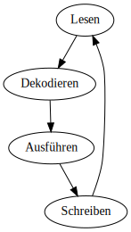
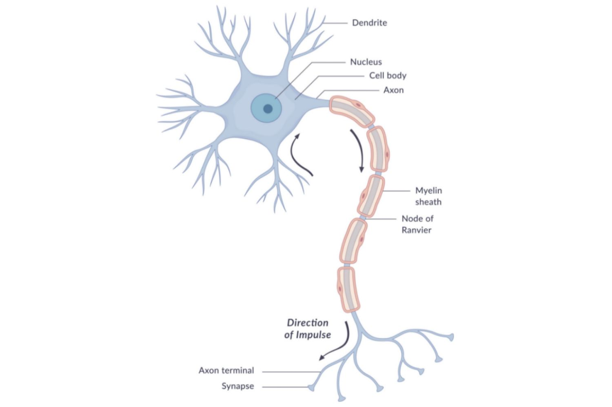
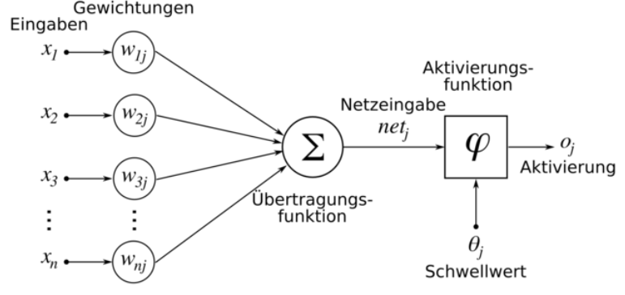

  <h1>Dörner-Netzwerke</h1>
  <table style="margin: 0 auto">
    <tr>
      <td></td>
      <td>
        Markus Rudolph 
        
        <strong>/ Lotes</strong>
        
      </td>
    </tr>
  </table>

---

# Motivation

* künstliche neuronale Netzwerke sind wirkungsvoll in der Mustererkennung
* allerdings ist die Herangehensweise sehr "analytisch" und schwer zurückverfolgbar
* Dörner's PSI-Netzwerke sind eher "diskreter" Natur und erinnern eher an Flussgraphen

---

# Literatur

Dies ist der Bamberger Professor Dietrich Dörner:

* BILD von Dietrich Dörner

Folgende Bücher erklären die PSI-Theorie von ihm.

* BILD von Bauplan für eine Seele
* BILD von Die Mechanik des Seelenwaagens

---

# Inhalt

* die Maschinensprache eines künstlichen Gehirns
* Abstraktionen innerhalb dieser Sprache

---

# Assembler, die Maschinensprache

* Heutige Computer arbeiten für gewöhnlich mit einem Prozessor und einem Speicher.
  * Der Prozessor holt sich einen Befehl aus den Speicher.
  * Er dekodiert den Befehl und führt ihn aus.
  * Das Ergebnis wird in den Speicher zurückgeschrieben.
  * Nächster Befehl...

---

# Maschinensprache des Gehirns

"Das Gehirn des Menschen besitzt ca. 90 Milliarden Neuronen welche über 100 Billionen Synapsen miteinander verbunden sind."

Die Nervenzelle hat einen Takt von `1.000` Signalen die Sekunde, sprich `1 kHz`. Künstliche Neuronen sind ein Vielfaches schneller.

---

# Prozessor Nervenzelle

Jedes Neuron ist ein Prozessor, mit `n` eingehenden Synapsen und einem Ausgabesignal, welches über `m` ausgehende Synapsen verteilt wird.

Dabei gibt es nur ein Signal, wenn die Summe der eingehenden Signale einen Schwellwert übersteigt! Die Leistung steckt aber eher in der Parallelität.

---

# Prozessor Nervenzelle: Begriffe

* Synapsen haben *Gewichte* (positiv wie negativ!).
* Die Aktivierung einer Nervenzelle wandert über die Ausgangssynapsen zu anderen Nervenzellen. Der Aktivierungswert der Quellzelle wird mit dem Synapsengewicht multipliziert.
* Die *Übertragungsfunktion* summiert alle eingehenden gewichteten Signalle auf zu einer *Netzeingabe*.
* eine *Aktivierungsfunktion* feuert ein Signal (der Zielzelle), wenn ein Schwellwert überstiegen wird.

---

# Prozess künstlicher Neuronen

Der klassische Ansatz ist Neuronen mit Eingaben zu füttern und die Ausgaben weiterzupropagieren bis zu einem Punkt an dem man eine Entscheidung erhält.

Beim Training wird dann der Fehler (z.B. das Delta) zurückpropagiert.

---

# Nervenzellen bei Dörner

Dörner's Netze funktionieren anders. Es gibt keinen Fehler-zurückspiel-Schritt. Stattdessen gibt es `4` verschiedene Neuronen:

* `aktivierende` Nervenzellen haben nur Synapsen mit positiven Gewichten. Sie aktivieren Nervenzellen, wenn der Schwellwert der Zielzelle überschritten wird.
* `hemmende` Nervenzellen haben nur Synapsen mit negativen Gewichten. Sie tragen negativ zur Aktivierung von Nervenzellen bei.
* `assozierende` Nervenzellen haben auch nur positive Gewichte an den Synapsen. Allerdings aktivieren sie nicht, sondern verstärken Synapsengewichte, wenn Quell-, Ziel- und diese Zelle aktiv sind.
* `disassoziierende` Nervenzellen hingegen schwächen die Gewichte unter der selben Bedingung.

---

# Prozess bei Dörner

Anstatt einen Fehler abzuwarten, kann dass Netz sich selbst manipulieren!

  * Hebb-Lernregel
* Einfache Operationen
  * Weiche/IfThenElse
  * Feldoperationen
* komplexere Strukturen
  * Quad
  * Cortex
  * Programmketten
* Denkbare Projekte
  * neuronales Assembler -> Neuronen beschreiben und ausführen
  * neuronales C++ -> Module/Gruppierungen
  * Tests/Coverage-Werkzeuge
  * OpenCL-Simulation
  * FPGA-Simulation mit seeeehr vielen Kernen
